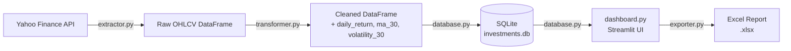

# Investment Report Pipeline

A small end-to-end ETL pipeline that pulls historical stock price data from Yahoo
Finance, cleans and enriches it with financial indicators, persists it in a local
SQLite database, and exposes it through an interactive Streamlit dashboard —
including Excel report export.

Built as a portfolio project to demonstrate the kind of data pipeline and
reporting workflow commonly used in investment/asset management contexts:
**Extract → Transform → Load → Visualize/Export**.

## Overview

- Fetches OHLCV (Open/High/Low/Close/Volume) data for any list of ticker symbols
  (e.g. `AAPL`, `MSFT`, `SAP.DE`, `SIE.DE`) via [yfinance](https://github.com/ranaroussi/yfinance)
- Cleans the raw data (missing values, invalid prices, duplicates) and computes
  daily return, a 30-day moving average, and 30-day rolling volatility per symbol
- Loads the result into a local SQLite database
- Visualizes it in a Streamlit dashboard with KPI cards, an interactive Plotly
  price chart, and a daily-return chart
- Exports a two-sheet Excel report (raw data + per-symbol summary) on demand

## Architecture

The pipeline follows a classic **ETL** structure, with the dashboard sitting on
top as both a consumer (visualization) and a trigger (re-running the pipeline
on demand):



Each stage is a separate, single-responsibility module — a stage can be tested,
run, or explained independently of the others.

## Tech Stack

| Layer               | Technology                          | Purpose                                      |
|---------------------|--------------------------------------|-----------------------------------------------|
| Data source          | [yfinance](https://pypi.org/project/yfinance/) | Historical market data from Yahoo Finance     |
| Data processing       | [pandas](https://pandas.pydata.org/)          | Cleaning, aggregation, rolling calculations   |
| Storage               | SQLite (`sqlite3`, standard library)          | Lightweight, file-based persistence           |
| Dashboard / UI        | [Streamlit](https://streamlit.io/)            | Interactive web app, no separate frontend needed |
| Charts                | [Plotly](https://plotly.com/python/)          | Interactive, hoverable line & bar charts      |
| Reporting             | [openpyxl](https://openpyxl.readthedocs.io/) (via pandas) | Multi-sheet Excel export              |
| Configuration         | [python-dotenv](https://pypi.org/project/python-dotenv/) | Environment variable management (reserved for future use) |

## Setup

**Prerequisites:** Python 3.11+

```bash
# 1. Clone the repository
git clone <repo-url>
cd investment-pipeline

# 2. Create and activate a virtual environment
python3 -m venv venv
source venv/bin/activate        # Windows: venv\Scripts\activate

# 3. Install dependencies
pip install -r requirements.txt

# 4. Launch the dashboard
streamlit run app/dashboard.py
```

The app opens at `http://localhost:8501`. On first launch the database is empty —
select or add symbols in the sidebar and click **"Daten aktualisieren"** to run
the pipeline and populate it.

## Project Structure

```
investment-pipeline/
├── app/
│   ├── extractor.py      # Extract: pulls OHLCV data from Yahoo Finance
│   ├── transformer.py    # Transform: cleaning + financial indicators
│   ├── database.py       # Load: SQLite persistence & queries
│   ├── exporter.py       # Report: Excel export (openpyxl)
│   └── dashboard.py       # Streamlit UI, ties all modules together
├── data/
│   └── investments.db     # SQLite database (generated at runtime)
├── exports/
│   └── investment_report_*.xlsx  # Generated Excel reports
├── requirements.txt
└── README.md
```

## Screenshots

> _Placeholder — add screenshots of the running dashboard here._

| KPI Overview & Price Chart | Excel Export |
|---|---|
|  |  |

## Key Concepts

A few design decisions worth highlighting (useful talking points for a technical
walkthrough):

**Object-oriented thinking, applied pragmatically.** The codebase favors small,
pure functions over custom classes — each module (`extractor`, `transformer`,
`database`, `exporter`) is a cohesive unit with a single responsibility, which is
the same goal OOP encapsulation aims for, just expressed at the module level
instead of the class level. Where state does need to be encapsulated (the SQLite
connection), it's represented by a real object — `sqlite3.Connection` — and passed
explicitly into functions rather than held in a global. This keeps functions
side-effect-free with respect to global state and easy to test in isolation.

**Design patterns in use:**
- **Pipeline pattern (ETL):** each stage (`extract → transform → load`) takes the
  previous stage's output as its only input and returns a new DataFrame — no
  stage reaches into another's internals, so stages can be reordered, tested, or
  swapped independently.
- **Dependency Injection:** `database.py` functions take a `conn` argument
  instead of opening a hidden global connection. This makes the code easy to
  point at a different database (e.g. an in-memory SQLite DB for tests) without
  changing the functions themselves.
- **Repository pattern:** `database.py` is the only module that knows SQL. Every
  other module reads/writes plain DataFrames — if the storage backend changed
  from SQLite to Postgres, only `database.py` would need to change.
- **Full-refresh Load:** `load()` uses `if_exists='replace'`, treating every
  pipeline run as producing a complete, authoritative snapshot rather than an
  incremental merge — simpler to reason about and avoids partial/duplicate state.

**Sanity checks (data quality gate).** Before any financial metric is calculated,
`transformer.py` runs three checks and logs what it finds:
1. **Missing values** — incomplete rows (e.g. a failed API response) are dropped
   rather than silently propagated into a moving average.
2. **Negative or zero prices** — a data error (or corporate action artifact) that
   would otherwise distort `daily_return` and volatility.
3. **Duplicate `(date, symbol)` rows** — guards against double-counting if a
   fetch is accidentally run twice for overlapping periods.

In a financial reporting context, silently computing metrics on bad data is worse
than raising visibility on it — hence checks run and log their findings before
any downstream calculation happens, rather than failing silently or crashing.

## License

This is a personal portfolio project, provided as-is for demonstration purposes.
